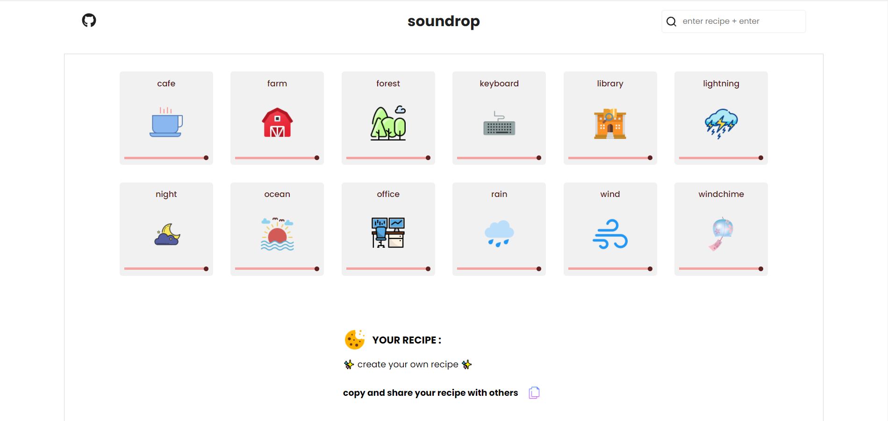

<div id="top"></div>

<br />
<div align="center">
  <h1 align="center">Soundrop</h1>

  <p align="center">
     Create the perfect environment to work and relax
  </p>
</div>

## Demo

Here is a quick demo of the app. I hope you enjoy it.

> [The Demo Link](https://naim30.github.io/soundrop/)

## About The Project



This app was created with reactjs. You can use this tool to build a sound mix that will help you become more productive, focused, or relaxed.
<br>

You can find many sounds like...

- cafe, farm, forest, rain, windchime etc...

### Share :

You can create your personal recipe of sound and share it with your friends.
<br>
Paste recipe and press enter, it will play sound mix they created.

Here's why:

- I created this app so that I can be more productive.
- in addition I also learn how to use audio in reactjs

Create your sound mix and share it with your friends...

## Built With

To build this App I used..

- React JS

## Getting Started

step 1 : Clone the repo

```sh
git clone https://github.com/naim30/soundrop.git
```

step 2 : Install libraries

```sh
cd soundrop
npm install
```

step 3 : Open the app in localhost

```sh
npm start
```

## Contact

Naimish Lukhi :
Email - naimlukhi30@gmail.com :
[LinkedIn](https://www.linkedin.com/in/naimish-lukhi-a2b14a1b9)

Project Link: [https://github.com/naim30/mastermind-game](https://github.com/naim30/mastermind-game)

<p align="right">(<a href="#top">back to top</a>)</p>
